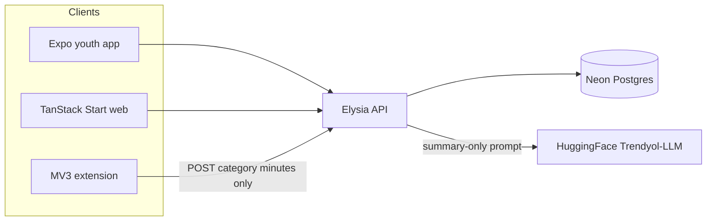
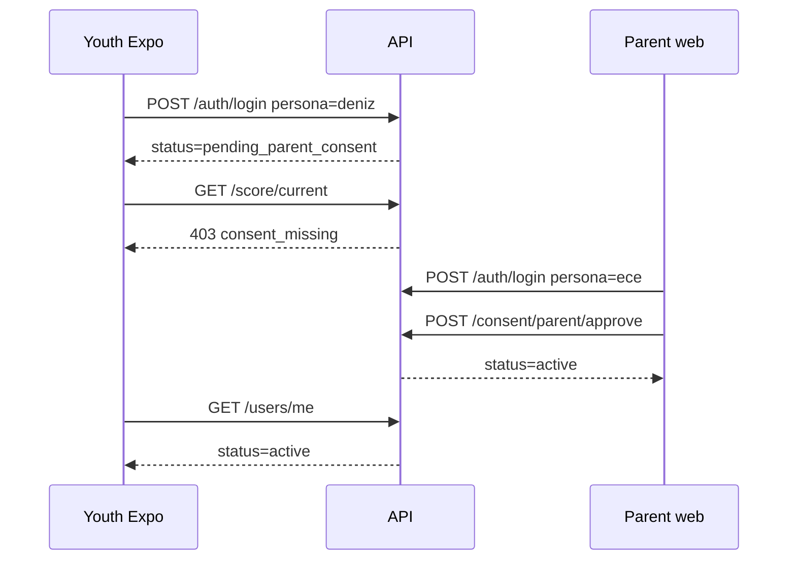
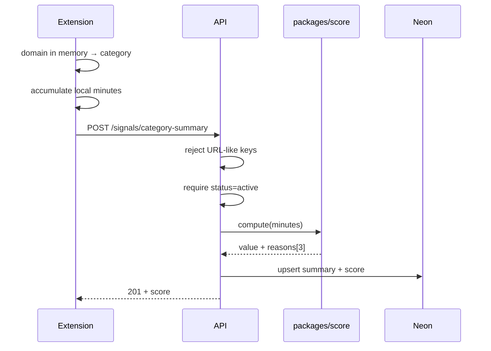
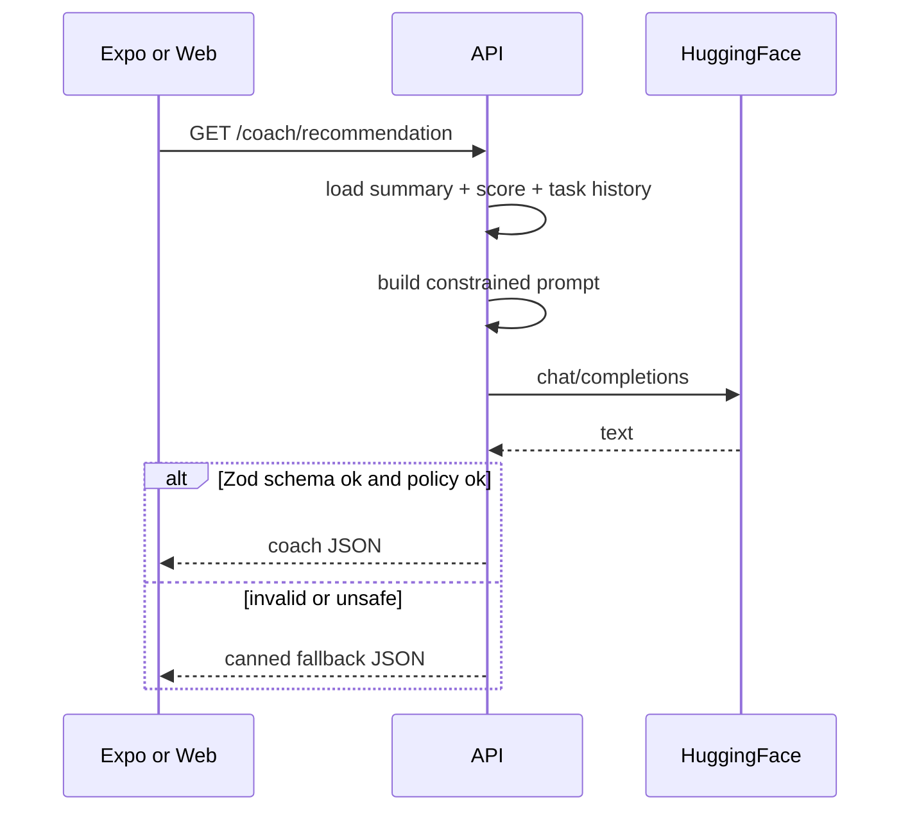

# Architecture (Phase A / MVP)

Audience: engineers and coding agents. Product context is in [`PRODUCT.md`](PRODUCT.md). HTTP shapes are in [`API.md`](API.md). Privacy is in [`PRIVACY.md`](PRIVACY.md).

## Context



No client talks to HuggingFace directly. The extension never sends URLs.

## Stack (locked for Phase A)

| Layer | Choice | Purpose |
|---|---|---|
| Web | TanStack Start, TypeScript, Tailwind, TanStack Query/Form/Table, i18next | Parent/teacher panels + marketing |
| Mobile | Expo, React Native, TypeScript | Youth demo |
| Extension | WebExtensions Manifest V3 | Domain→category minutes on device |
| API | Bun, Elysia, Zod, REST/OpenAPI | Single modular service |
| Auth | Demo session/JWT + RBAC | Youth, parent, teacher, admin |
| Jobs | **None in MVP** | Weekly report is computed on read |
| Data | Neon serverless Postgres, Prisma | App data; no pgvector in MVP |
| Score | TypeScript rule engine in `packages/score` | Explainable 0–100 |
| LLM | Trendyol-LLM via HuggingFace Inference | Coach JSON |
| Object storage | **None in MVP** | No user file uploads |
| Monorepo | Turborepo + Bun workspaces | Shared types |
| Quality | ESLint, tsc, Vitest, Playwright | Unit + critical E2E |
| A11y | WCAG 2.1 AA on critical screens | Keyboard, labels, contrast |

Phase B+ (do **not** build now): self-hosted Postgres 16, pg-boss, pgvector RAG, BERTurk + LightGBM FastAPI classifier, Ollama/llama.cpp, S3, Sentry/Grafana at production depth, Kubernetes.

## Repo layout (target)

```
apps/api              Elysia + Prisma
apps/web              TanStack Start
apps/mobile           Expo
apps/extension        MV3
packages/shared       Zod types, category ids, error codes
packages/score        Pure score function + reason picker
```

## Workflows

### W1 — Consent and activation



### W2 — Signals → score



Seed scripts may POST the same body without the extension.

### W3 — Score → coach



Prompt **may** include: category minutes, score + reasons, chosen goal, completed task titles.

Prompt **must not** include: URLs, hostnames, messages, names of classmates, free-text browse history.

### W4 — Weekly report

On `GET /reports/weekly`, aggregate last 7 days (or the latest summary period in MVP — one period is enough). Web renders score, distribution, trend, task status, empty and error states.

## Data model (Prisma sketch)

No `url`, `hostname`, `path`, or `rawContent` columns. Anywhere.

```prisma
enum Role { youth parent teacher admin }
enum AccountStatus { pending_parent_consent active revoked }
enum TaskStatus { open completed }

model User {
  id            String         @id
  role          Role
  status        AccountStatus  @default(pending_parent_consent)
  displayName   String
  personaKey    String?        // demo only: deniz_balanced | deniz_risky | deniz_productive
  parentId      String?
  parent        User?          @relation("ParentChildren", fields: [parentId], references: [id])
  children      User[]         @relation("ParentChildren")
  summaries     CategorySummary[]
  scores        Score[]
  tasks         Task[]
  consents      ConsentEvent[] @relation("YouthConsent")
}

model ConsentEvent {
  id        String   @id @default(cuid())
  youthId   String
  youth     User     @relation("YouthConsent", fields: [youthId], references: [id])
  actorId   String
  action    String   // approve | revoke
  createdAt DateTime @default(now())
}

model CategorySummary {
  id        String   @id @default(cuid())
  youthId   String
  youth     User     @relation(fields: [youthId], references: [id])
  periodStart DateTime
  periodEnd   DateTime
  minutes   Json     // CategoryMinutes — validated in app
  createdAt DateTime @default(now())
  @@unique([youthId, periodStart, periodEnd])
}

model Score {
  id          String   @id @default(cuid())
  youthId     String
  youth       User     @relation(fields: [youthId], references: [id])
  value       Int      // 0-100
  reasons     Json     // string[3]
  periodStart DateTime
  periodEnd   DateTime
  computedAt  DateTime @default(now())
}

model Task {
  id          String     @id @default(cuid())
  youthId     String
  youth       User       @relation(fields: [youthId], references: [id])
  title       String
  steps       Json
  etaMinutes  Int
  status      TaskStatus @default(open)
  badge       String?
  completedAt DateTime?
}

model CoachRecommendation {
  id         String   @id @default(cuid())
  youthId    String
  tips       Json     // string[3]
  shareText  String
  taskId     String?
  source     String   // model | fallback
  createdAt  DateTime @default(now())
}

model DeletionRequest {
  id        String   @id @default(cuid())
  youthId   String
  status    String   // pending | completed
  createdAt DateTime @default(now())
}
```

Connection: Prisma is the **only** DB access layer. Neon connection string from env (`DATABASE_URL`). Use Neon’s pooled URL in serverless/dev as documented by Neon.

## Score v0.5 (proposal — not in Notion)

Explainable rules. **No ML. No LLM.** Implementation lives in `packages/score` and must be unit-tested.

### Categories

| id | Kind | Turkish label |
|---|---|---|
| `science` | valuable | Bilim |
| `arts` | valuable | Sanat |
| `sports` | valuable | Spor |
| `culture` | valuable | Kültür |
| `entrepreneurship` | valuable | Girişimcilik |
| `national_memory` | valuable | Millî hafıza |
| `entertainment` | neutral | Eğlence |
| `harmful` | negative | Zararlı / manipülatif |

### Formula

Let `total` be the sum of minutes (if `total === 0`, do not score — API returns `no_data`).

```
valuableShare      = sum(valuable minutes) / total
harmfulShare       = harmful / total
entertainmentShare = entertainment / total
diversity          = count of valuable categories with minutes >= 10   // 0..6

score = 50
      + 30 * valuableShare
      + 5  * diversity
      - 40 * harmfulShare
      - 20 * max(0, entertainmentShare - 0.5) / 0.5

clamp to [0, 100], round to nearest int.
```

Worked example (balanced Deniz): science 40, arts 15, sports 20, culture 10, national_memory 5, entertainment 120, others 0. `total=210`, `valuableShare=90/210≈0.429`, `diversity=4`, `entertainmentShare≈0.571`, `harmfulShare=0` → `50 + 12.86 + 20 − 2.86 = 80`.

If the demo personas need visually distinct scores, **adjust the seed minutes**, not the formula.

### Reasons

Emit **exactly 3** Turkish strings from the same signals. Rank candidates by absolute contribution, take top 3, stable order:

1. If `harmfulShare >= 0.05`: `"Zararlı veya manipülatif kategoride süre var; bunu bir yetişkinle konuşmak iyi olabilir."`
2. If `entertainmentShare >= 0.5`: `"Eğlence kategorisi sürenin çoğunu kaplıyor."`
3. If `valuableShare >= 0.35`: `"Bilim, sanat, spor veya kültür kategorilerinde görünür bir payın var."`
4. If `diversity >= 3`: `"Birden fazla değerli kategoride zaman geçirmişsin."`
5. If `diversity <= 1`: `"Kategori çeşitliliğin düşük; kısa bir keşif görevi dene."`
6. If `harmfulShare === 0`: `"Zararlı/manipülatif kategoride süre görünmüyor."`
7. Fallback fillers so the array is always length 3:
   - `"Skor, yasaklamak için değil; kendi dengenı görmen için."`
   - `"Küçük bir görev, haftalık dengeyi değiştirebilir."`

Never: diagnosis, “bağımlılık”, “kötü çocuk”, URLs, hostnames.

## LLM boundary

- Provider: HuggingFace Inference router (exact model id in env `HF_MODEL_ID`, token `HF_TOKEN`). The code is model-agnostic: it sends OpenAI-style chat completions and judges the answer by the schema, not by the vendor.
- **Trendyol-LLM is not callable today** (verified 2026-09-17): the router lists 143 served models and no inference provider serves any Trendyol id, so `router.huggingface.co` cannot route to it. Keeping it would mean renting a dedicated HF Inference Endpoint. The demo therefore runs `Qwen/Qwen3-8B`, which speaks Turkish and satisfies the coach schema about three times in four; the rest fall back, which is the designed behaviour. Swap `HF_MODEL_ID` back the day a provider serves Trendyol.
- Temperature low (≤ 0.4). Token budget must cover a **reasoning** pass: Qwen3-class models fill `reasoning_content` first and leave `content` null if the budget runs out, so 500 returned nothing every time and 900 returns valid JSON.
- HF's free monthly credit is small; once it is depleted the router answers `402` and every coach call falls back. That is a cost signal, not an outage.
- Ask for **JSON only** matching the coach schema.
- Validate with Zod. On failure: canned fallback (see building block 04).
- Safe-language post-check: reject output containing diagnostic phrases; fallback.

## AuthZ matrix (MVP)

| Endpoint | youth | parent | teacher | admin |
|---|---|---|---|---|
| `POST /auth/login` | public | public | public | public |
| `GET /users/me` | self | self | self | self |
| `POST /consent/parent/approve` | no | linked youth | no | yes |
| `POST /signals/category-summary` | self, active | no | no | no |
| `GET /score/current` | self, active | linked | linked | yes |
| `GET /coach/recommendation` | self, active | no (they see `share_text` on report) | no | no |
| `GET /reports/weekly` | self | linked | linked / class | yes |
| `POST /tasks/:id/complete` | self | no | no | no |

## Error model

Use [`API.md`](API.md) codes. Clients must implement:

- `consent_missing` → waiting-for-parent screen
- `no_data` / `empty: true` → empty analysis screen
- network / 503 → error with retry, no stack traces

## Scalability (MVP honesty)

One Bun process + Neon is enough for a jury demo. Horizontal scale and workers are Phase C. Do not split microservices.

## Key decisions

| Decision | Rationale |
|---|---|
| Neon instead of local PG 16 | Locked in MVP Scope; less ops for a two-person team |
| HF Trendyol-LLM instead of local Ollama | Locked in MVP Scope; demo-able without GPU |
| Score in TypeScript, not Python | One runtime in MVP; classifier Python service is Phase B |
| Report on-read, no pg-boss | One happy path; no job infra to fail in a live demo |
| Domain-level extension, not content scripts scraping feeds | Privacy contract + closed platform APIs |
| Canned coach fallback | Demo must not die if HF is slow or returns prose |
