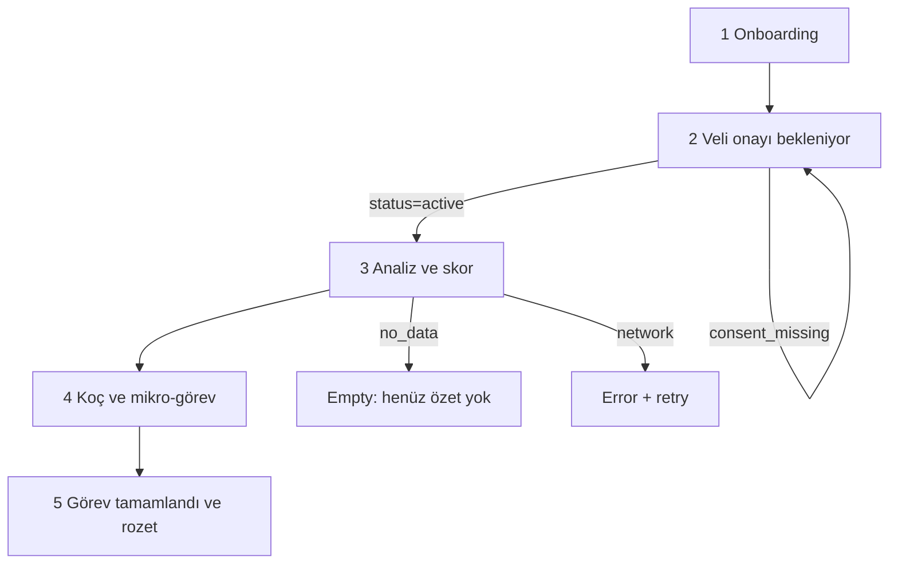

# Design — IA, screens, copy, UX principles

Visual exploration is out of scope for this file. This is the contract for UI structure, states, and Turkish copy. Personas: [`PRODUCT.md`](PRODUCT.md).

## Principles

1. **Youth first.** Mobile, 1–3 minute tasks, dark-theme friendly, one idea per screen.
2. **Score is a mirror, not a grade.** No traffic-light “iyi/kötü çocuk”. Prefer a 0–100 number + three plain-language reasons.
3. **Privacy is visible.** Critical screens show that raw URLs are not collected.
4. **Non-judgmental, non-diagnostic.** High `harmful` share → support language, not a verdict.
5. **Short Turkish.** No academic paragraphs on youth screens. Parents get “ne oldu?” + “birlikte ne yapabiliriz?”
6. **WCAG 2.1 AA** on critical flows: 4.5:1 contrast, keyboard, labels, 200% zoom, focus visible.
7. **One happy path + empty + error.** Do not design extra dashboards for MVP.

## Youth journey (Expo)

Join → wait for parent → first analysis → score explanation → micro-task → complete → badge → optional share.

## Expo screens (MVP)

### 1. Onboarding / katılım (mock)

- Wordmark NEXORA.
- One sentence: what the app does.
- Primary: “Katıl”.
- Secondary link: “Verilerim nasıl kullanılır?” → privacy snippet, not a legal novel.
- Demo: no real email/password. Persona login via debug switch (below).

Copy:

- Title: `NEXORA`
- Sub: `Sosyal medyayı ölç, anla, küçük bir adım at.`
- CTA: `Katıl`
- Privacy line: `Ham bağlantı, mesaj veya arama kaydı toplanmaz.`

### 2. Veli onayı bekleniyor

Shown while `status === pending_parent_consent`.

- Explain that the account is not active.
- What the parent will see: category trends, not history.
- No score yet.

Copy:

- Title: `Veli onayı bekleniyor`
- Body: `Hesabın, bir veli onaylayana kadar açılmaz. Veli yalnızca kategori özetlerini görür; tam bağlantı yok.`
- Hint (demo): `Jüri demosu: web panelinden Ece olarak onayla.`

### 3. Analiz ve skor

- Large score `value` (0–100).
- Exactly three `reasons`.
- Mini distribution (8 categories, bars or stacked — keep readable at phone width).
- KVKK line again.
- States: `loading` / `empty` / `error` / `ready`.

Empty: `Henüz kategori özeti yok. Eklenti özet gönderince veya demo verisi yüklenince skorun burada olur.`

Error `consent_missing`: return to screen 2.

Copy (ready header): `Bu haftaki dengen`

Do not color the whole screen red/green from the score. Reasons carry the meaning.

### 4. Koç önerileri + mikro-görev

- 3 tips (short cards).
- 1 task: title, steps, `eta_minutes`.
- Primary CTA: `Görevi tamamladım`.
- Language: actionable, second person, no shame.

### 5. Görev tamamlandı + rozet

- Badge `degerli_adim` (MVP: one badge is enough).
- Optional `share_text` preview (“Velinle paylaşılacak özet”).
- CTA: `Panele yansısın` (informational — completing the task is the API call).

### Demo persona switch

Hidden: long-press wordmark **or** `__DEV__` menu.

Options: `Dengeli` / `Riskli` / `Üretken` → login as `deniz_balanced` | `deniz_risky` | `deniz_productive` and load that seed (see below). Three personas must yield **different** scores and coach tips.

### Expo UI states (all data screens)

| State | UI |
|---|---|
| `loading` | Skeleton, not a spinner-only blank |
| `empty` | Short explanation + what to do next |
| `error` | Message + retry. No raw exception |
| `ready` | Content |

## Web IA

### Public (marketing)

| Route | Purpose |
|---|---|
| `/` | Landing |
| `/how-it-works` | 4-step loop + report screenshot placeholder |
| `/privacy` | Collected vs never + consent/revoke |
| `/faq` | 3–5 questions |

### App (after demo login)

| Route | Role |
|---|---|
| `/app/parent` | Veli weekly report |
| `/app/teacher` | Öğretmen weekly report (MVP: same report chrome, class label) |
| `/app/admin` | Optional — consent list only if time |

### Layouts

- **Public:** Header (logo, nav: Nasıl çalışır, Gizlilik, SSS, Giriş) + Footer (KVKK links).
- **App:** AppShell — left nav (Rapor, Gizlilik, Çıkış) + main. Parent vs teacher: role badge.

## Web page copy (MVP)

### Landing `/`

Hero:

- Title: `Ölç → Anla → Koçla → Üret`
- Sub: `13–18 yaş için yerli sosyal yapay zekâ. Yasaklamadan, yargılamadan.`
- Trust: `Ham URL yok. Mesaj yok. Arama kaydı yok.`
- CTA: `Nasıl çalışır?` → `/how-it-works`. Secondary: `Veli paneli (demo)` → login.

Three cards:

1. **Genç** — `Kısa skor, kısa görev, görünür üretim.`
2. **Veli** — `Kategori eğilimleri ve birlikte hedef. Geçmiş dökümü yok.`
3. **Öğretmen** — `Sınıf özeti dakikalar içinde.`

### How it works `/how-it-works`

Four steps matching the loop. One placeholder frame: “örnek haftalık rapor”.

### Privacy `/privacy`

Table: collected vs never (from [`PRIVACY.md`](PRIVACY.md), Turkish labels). Sections: veli onayı, geri çekme (30 gün), “tanı koymaz”.

### FAQ `/faq`

- `Şifrelerinizi istiyor musunuz?` → `Hayır.`
- `Ham içerik okunuyor mu?` → `Hayır. Yalnızca izinli kategori dakikaları.`
- `Kim neyi görür?` → `Genç kendi özetini; veli/öğretmen toplu kategorileri. Tam bağlantı yok.`
- `Ruh sağlığı tanısı koyuyor mu?` → `Hayır. Risk dilinde destek önerisi vardır.`

### Parent panel `/app/parent`

- Demo persona picker for the linked youth (dengeli / riskli / üretken) so the jury can switch without re-seeding by hand.
- Weekly report: score, 3 reasons, distribution, trend (2 points is enough), current task status, `share_text`.
- Lightweight shared-goal suggestion: one sentence, not a full goal module.
- Empty: `Bu hafta henüz özet yok.`
- Error: retry.
- KVKK strip: `Bu panelde tam bağlantı veya alan adı gösterilmez.`

### Teacher panel `/app/teacher`

Same report block. Header: `Sınıf özeti (demo)` instead of `Çocuğunun haftası`. MVP may show a single demo youth as the class example. Do not build a 50-row student table.

## Visual tokens (starter)

Keep a small, distinctive palette — not generic purple SaaS.

| Token | Value | Use |
|---|---|---|
| `--bg` | `#0F1412` | Youth + app dark |
| `--surface` | `#1A221C` | Cards |
| `--text` | `#F4F1EA` | Primary text |
| `--muted` | `#A7B0A1` | Secondary |
| `--accent` | `#C4F542` | CTAs, score ring (chartreuse, not traffic-green) |
| `--warn` | `#E4B44C` | Support suggestion, not alarm |
| `--danger` | `#D45D4A` | Errors only, never score |
| `--font-display` | Fraunces or similar serif | Wordmark / hero only |
| `--font-ui` | Source Sans 3 / system-ui | Body |

Public marketing may use the same tokens with a slightly lighter surface. Do not introduce a second brand.

Youth score ring uses `--accent` at any value. Reasons, not color, encode “needs attention”.

## Demo seeds (minutes → distinct scores)

Use these exact minutes so UI, API, and jury script agree. Formula: [`ARCHITECTURE.md`](ARCHITECTURE.md).

| Persona | science | arts | sports | culture | entrepreneurship | national_memory | entertainment | harmful | expected score band |
|---|---|---|---|---|---|---|---|---|---|
| `deniz_balanced` | 40 | 15 | 20 | 10 | 0 | 5 | 120 | 0 | ~80 |
| `deniz_risky` | 10 | 0 | 0 | 0 | 0 | 0 | 200 | 40 | ~38 |
| `deniz_productive` | 70 | 20 | 20 | 15 | 0 | 0 | 40 | 0 | ~93 |

Coach fallback (if HF is down) must still **differ by persona** using canned maps keyed by persona or by score band (`<50`, `50–79`, `≥80`).

## Accessibility checklist (critical screens)

- All icon-only controls have `aria-label`.
- Score value is text, not color-only.
- Forms (demo login, consent button) are keyboard operable.
- Focus visible on dark background.
- Privacy table on `/privacy` is a real `<table>` or definition list, not a screenshot.

## Out of design scope (MVP)

- Full design system documentation site.
- Illustration set, lottie onboarding, gamified map.
- Native share-to-Instagram stories.
- Teacher seating-chart visualization.
