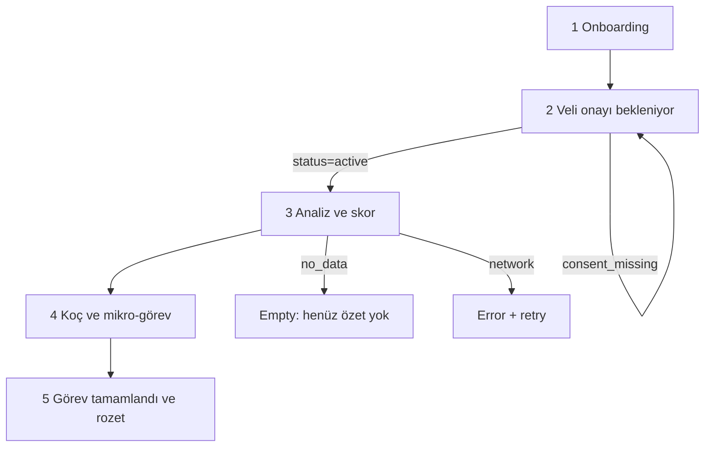

# Design — IA, screens, copy, UX principles

Visual exploration is out of scope for this file. This is the contract for UI structure, states, and Turkish copy. Personas: [`PRODUCT.md`](PRODUCT.md).

## Principles

1. **Youth first.** Mobile, 1–3 minute tasks, one idea per screen, light and high-contrast.
2. **Score is a mirror, not a grade.** No traffic-light “iyi/kötü çocuk”. Prefer a 0–100 number + three plain-language reasons.
3. **Privacy is visible.** Critical screens show that raw URLs are not collected.
4. **Non-judgmental, non-diagnostic.** High `harmful` share → support language, not a verdict.
5. **Short Turkish.** No academic paragraphs on youth screens. Parents get “ne oldu?” + “birlikte ne yapabiliriz?”
6. **WCAG 2.1 AA** on critical flows: 4.5:1 contrast, keyboard, labels, 200% zoom, focus visible.
7. **One happy path + empty + error.** Do not design extra dashboards for MVP.

## Youth journey (Expo)

Join → wait for parent → first analysis → score explanation → micro-task → complete → badge → optional share.

## Expo screens (MVP)

### 1. Onboarding / katılım (mock)

- Wordmark NEXORA.
- One sentence: what the app does.
- Primary: “Katıl”.
- Secondary link: “Verilerim nasıl kullanılır?” → privacy snippet, not a legal novel.
- Demo: no real email/password. Persona login via debug switch (below).

Copy:

- Title: `NEXORA`
- Sub: `Sosyal medyayı ölç, anla, küçük bir adım at.`
- CTA: `Katıl`
- Privacy line: `Ham bağlantı, mesaj veya arama kaydı toplanmaz.`

### 2. Veli onayı bekleniyor

Shown while `status === pending_parent_consent`.

- Explain that the account is not active.
- What the parent will see: category trends, not history.
- No score yet.

Copy:

- Title: `Veli onayı bekleniyor`
- Body: `Hesabın, bir veli onaylayana kadar açılmaz. Veli yalnızca kategori özetlerini görür; tam bağlantı yok.`
- Hint (demo): `Jüri demosu: web panelinden Ece olarak onayla.`

### 3. Analiz ve skor

- Large score `value` (0–100).
- Exactly three `reasons`.
- Mini distribution (8 categories, bars or stacked — keep readable at phone width).
- KVKK line again.
- States: `loading` / `empty` / `error` / `ready`.

Empty: `Henüz kategori özeti yok. Eklenti özet gönderince veya demo verisi yüklenince skorun burada olur.`

Error `consent_missing`: return to screen 2.

Copy (ready header): `Bu haftaki dengen`

Do not color the whole screen red/green from the score. Reasons carry the meaning.

### 4. Koç önerileri + mikro-görev

- 3 tips (short cards).
- 1 task: title, steps, `eta_minutes`.
- Primary CTA: `Görevi tamamladım`.
- Language: actionable, second person, no shame.

### 5. Görev tamamlandı + rozet

- Badge `degerli_adim` (MVP: one badge is enough).
- Optional `share_text` preview (“Velinle paylaşılacak özet”).
- CTA: `Panele yansısın` (informational — completing the task is the API call).

### Demo persona switch

Hidden: long-press wordmark **or** `__DEV__` menu.

Options: `Dengeli` / `Riskli` / `Üretken` → login as `deniz_balanced` | `deniz_risky` | `deniz_productive` and load that seed (see below). Three personas must yield **different** scores and coach tips.

### Expo UI states (all data screens)

| State | UI |
|---|---|
| `loading` | Skeleton, not a spinner-only blank |
| `empty` | Short explanation + what to do next |
| `error` | Message + retry. No raw exception |
| `ready` | Content |

## Web IA

### Public (marketing)

| Route | Purpose |
|---|---|
| `/` | Landing |
| `/how-it-works` | 4-step loop + report screenshot placeholder |
| `/privacy` | Collected vs never + consent/revoke |
| `/faq` | 3–5 questions |

### App (after demo login)

| Route | Role |
|---|---|
| `/app/parent` | Veli weekly report |
| `/app/teacher` | Öğretmen weekly report (MVP: same report chrome, class label) |
| `/app/admin` | Optional — consent list only if time |

### Layouts

- **Public:** Header (logo, nav: Nasıl çalışır, Gizlilik, SSS, Giriş) + Footer (KVKK links).
- **App:** AppShell — left nav (Rapor, Gizlilik, Çıkış) + main. Parent vs teacher: role badge.

## Web page copy (MVP)

### Landing `/`

Hero:

- Title: `Ölç → Anla → Koçla → Üret`
- Sub: `13–18 yaş için yerli sosyal yapay zekâ. Yasaklamadan, yargılamadan.`
- Trust: `Ham URL yok. Mesaj yok. Arama kaydı yok.` — now in the navy announcement
  strip above the nav, so it shows on every public page instead of the hero only.
- CTA: `Nasıl çalışır?` → `/how-it-works`. Secondary: `Veli paneli (demo)` → login.

Three cards, under eyebrow `ROLLER` + heading `Kim ne görür?`:

1. **Genç** — `Kısa skor, kısa görev, görünür üretim.`
2. **Veli** — `Kategori eğilimleri ve birlikte hedef. Geçmiş dökümü yok.`
3. **Öğretmen** — `Sınıf özeti dakikalar içinde.`

### How it works `/how-it-works`

Four steps matching the loop. One placeholder frame: “örnek haftalık rapor”.

### Privacy `/privacy`

Table: collected vs never (from [`PRIVACY.md`](PRIVACY.md), Turkish labels). Sections: veli onayı, geri çekme (30 gün), “tanı koymaz”.

### FAQ `/faq`

- `Şifrelerinizi istiyor musunuz?` → `Hayır.`
- `Ham içerik okunuyor mu?` → `Hayır. Yalnızca izinli kategori dakikaları.`
- `Kim neyi görür?` → `Genç kendi özetini; veli/öğretmen toplu kategorileri. Tam bağlantı yok.`
- `Ruh sağlığı tanısı koyuyor mu?` → `Hayır. Risk dilinde destek önerisi vardır.`

### Parent panel `/app/parent`

- Demo persona picker for the linked youth (dengeli / riskli / üretken) so the jury can switch without re-seeding by hand.
- Weekly report: score, 3 reasons, distribution, trend (2 points is enough), current task status, `share_text`.
- Lightweight shared-goal suggestion: one sentence, not a full goal module.
- Empty: `Bu hafta henüz özet yok.`
- Error: retry.
- KVKK strip: `Bu panelde tam bağlantı veya alan adı gösterilmez.`

### Teacher panel `/app/teacher`

Same report block. Header: `Sınıf özeti (demo)` instead of `Çocuğunun haftası`. MVP may show a single demo youth as the class example. Do not build a 50-row student table.

## Visual tokens

Measured off [calendly.com](https://www.a1.gallery/website/calendly) via a1.gallery
(`get_website_sections` → `designTokens`) and applied verbatim in
`apps/web/src/styles.css`, `apps/mobile/src/ui.tsx` and the two extension pages.
This replaces the earlier dark chartreuse starter palette.

| Token | Value | Use |
|---|---|---|
| `--bg` | `#FCFBF8` | Page background (all apps, light) |
| `--band` | `#F1EFE9` | Beige hero / section band, chart tracks, skeletons |
| `--surface` | `#FFFFFF` | Cards — always on a `--line` border |
| `--line` | `#E4E0D8` | Hairline borders and dividers (non-text) |
| `--tint` | `#E7EEFB` | Light-blue pill and panel surface, 14:1 with `--text` |
| `--text` | `#071A31` | Navy ink, 16:1 on `--bg` |
| `--muted` | `#4D5F74` | Secondary text, 6.3:1 on `--bg` |
| `--accent` | `#071A31` | Primary CTA fill; `--bg` as its text is 16:1 |
| `--link` | `#0B5FD0` | Links, focus ring, chart fills, 5.8:1 on `--surface` |
| `--warn` | `#8A5A00` | Support suggestion, not alarm, 5.9:1 on `--surface` |
| `--danger` | `#B3261E` | Errors only, never score, 6.5:1 on `--surface` |
| `--font-display` | Geist 600, `-0.033em`, `line-height: 1.1` | Headings and wordmark |
| `--font-ui` | Geist 400 | Body |

Weights: 600 for headings — a1 measured 500 off the footer section, but the hero
and section headings on the reference pages are visibly heavier; the footer
statement is the one place that stays at 500. Body copy is 14–16px on a narrow
measure (`max-w-md` for hero sub, `max-w-2xl` for prose) at `line-height: 1.6`.
The size contrast between a 60px heading and 14px body is what makes the
reference read editorial, so do not grow the body to match the heading.

Shapes, also measured: cards `rounded-2xl` on a 1px `--line` border, bands and the
footer block `rounded-3xl`, buttons `rounded-lg`, no shadows. The one gradient is
the blue product panel in the hero.

Public page composition, in reference order: navy announcement strip carrying the
KVKK line, nav with mark + wordmark + one filled pill, an inset beige band
(`mx-2 rounded-3xl`) holding the heading block and the product frame, then
full-bleed sections whose content sits in the 1352px container, then the navy
footer block with one oversized statement. Sub-pages use the same band via
`PageHeader`. A small uppercase letterspaced eyebrow sits above section headings,
not above the hero heading.

The "örnek haftalık rapor" frame is markup (`apps/web/src/preview.tsx`), not a
screenshot, and uses the `deniz_balanced` seed numbers so it cannot drift from
the demo. It is `aria-hidden` and every caller captions it.

Geist loads from Google Fonts on web and falls back to `system-ui` offline. Expo
uses the platform grotesque — Geist there needs `expo-font` plus a bundled asset,
which Phase A skips.

Youth score ring uses `--accent` at any value. Reasons, not colour, encode
"needs attention". Public marketing and the app share one palette; do not
introduce a second brand.

Mobile adapts this composition with a persistent privacy strip, compact wordmark,
cream heading panels, and an Ölç / Anla / Koçla / Üret progress indicator. The
score sits on a blue panel; explanations use numbered rows and category labels
sit above their bars so long Turkish labels fit narrow screens. Coach tasks and
the earned badge share the blue treatment. Every screen also carries an
asset-free illustration: a small white metric card on a blue orbit with one
screen-specific cue (steps, consent, balance, tips, or badge). The illustration
is decorative but has a concise accessible label. Native fonts remain platform
defaults.

The extension popup and options page share `apps/extension/ui.css`: cream summary
panel, white category card, navy controls, and blue privacy note. The popup shows
the live category-minute total and an explicit paused/counting label. Both panels
repeat the same orbit/card illustration so the mobile and extension experiences
read as one product. Settings remain a single keyboard-submittable form, linked
directly from the popup.

## Demo seeds (minutes → distinct scores)

Use these exact minutes so UI, API, and jury script agree. Formula: [`ARCHITECTURE.md`](ARCHITECTURE.md).

| Persona | science | arts | sports | culture | entrepreneurship | national_memory | entertainment | harmful | expected score band |
|---|---|---|---|---|---|---|---|---|---|
| `deniz_balanced` | 40 | 15 | 20 | 10 | 0 | 5 | 120 | 0 | ~80 |
| `deniz_risky` | 10 | 0 | 0 | 0 | 0 | 0 | 200 | 40 | ~38 |
| `deniz_productive` | 70 | 20 | 20 | 15 | 0 | 0 | 40 | 0 | ~93 |

Coach fallback (if HF is down) must still **differ by persona** using canned maps keyed by persona or by score band (`<50`, `50–79`, `≥80`).

## Accessibility checklist (critical screens)

- All icon-only controls have `aria-label`.
- Score value is text, not color-only.
- Forms (demo login, consent button) are keyboard operable.
- Focus visible on dark background.
- Privacy table on `/privacy` is a real `<table>` or definition list, not a screenshot.

## Out of design scope (MVP)

- Full design system documentation site.
- Illustration set, lottie onboarding, gamified map.
- Native share-to-Instagram stories.
- Teacher seating-chart visualization.
