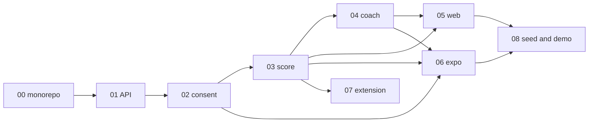

# Phases

Two layers: **product phases** (Notion roadmap) and **Phase A engineering slices** (building blocks 00–08). Agents implement slices, not “the whole MVP” in one pass.

## Product phases

### A — Competition MVP (now)

Working prototype with **clear limits**. Original Notion window was August–14 September 2026; treat this as immediate demo-ready work.

**In:** Expo youth, parent/teacher web, MV3 extension, score API v0.5, HF Trendyol-LLM coach, consent, KVKK copy, 3 demo personas.

**Out:** feed APIs, payments, ads, school field tests, fine-tune, Kubernetes, BERTurk, pg-boss, local GGUF.

**Proof:** 5–7 minute uninterrupted path — see [`building-blocks/08-demo-seed.md`](building-blocks/08-demo-seed.md).

### B — Pilot and validation (~4–6 months after final)

- Labeled dataset v1 + datasheet.
- BERTurk / score model vs blind test (Macro F1 ≥ 0.82, score MAE ≤ 6).
- Two schools: 24 youth, 12 parents, 6 teachers. SUS ≥ 75, task completion ≥ 85%.
- Six-week behavioral metrics (north star ≥ 30% weekly valuable action, +8 score points).
- Red team, privacy, RBAC tests.
- Prototype v1.0 after feedback.
- Infra deltas: pg-boss, pgvector RAG, local or TR-hosted LLM, self-hosted Postgres.

Do not start B work in this repo until A’s demo script is green.

### C — Production and scale

- Production-quality web + mobile.
- School ops, support, incident process.
- Small B2C family + B2B school license test.
- Partnerships (MEB, RTÜK, municipalities, school chains, NGOs).
- Hosting in Turkey, observability, modular pedagogy (finance, cyber).

## Phase A engineering slices

After **03**, web / expo / extension can proceed in parallel. **08** last.

### Claude Code workflow mapping

Keyword **`ultracode`**: orchestrator writes a dynamic **workflow** (not turn-by-turn). Terms: `phase()`, `agent()`, `parallel()`, `pipeline()`, subagent/worker, fan-out/fan-in. Ponytail **ultra** on every worker.

| `phase()` | Agents | Pattern |
|---|---|---|
| `foundations` | 00, 01, 02, 03 | serial `agent()` |
| `fan-out` | 04, 05, 06, 07 | `parallel()` — disjoint trees |
| `verify` | typecheck + tests + ponytail-review | one `agent()`, fail closed |
| `demo` | 08 | last `agent()` |

Prompt: [`prompts/claude-apply-phase-a.md`](prompts/claude-apply-phase-a.md). Save a working run as `.claude/workflows/nexora-phase-a.js`.

| Order | Block | Done when |
|---|---|---|
| 00 | [`building-blocks/00-monorepo.md`](building-blocks/00-monorepo.md) | `bun install` + shared Zod types |
| 01 | [`building-blocks/01-api.md`](building-blocks/01-api.md) | Health + Prisma on Neon |
| 02 | [`building-blocks/02-identity-consent.md`](building-blocks/02-identity-consent.md) | Youth pending until parent approve |
| 03 | [`building-blocks/03-signals-score.md`](building-blocks/03-signals-score.md) | POST minutes → score 80 / 38 / 93 fixtures |
| 04 | [`building-blocks/04-llm-coach.md`](building-blocks/04-llm-coach.md) | Coach JSON; fallback if HF down |
| 05 | [`building-blocks/05-web.md`](building-blocks/05-web.md) | Public pages + weekly report empty/error |
| 06 | [`building-blocks/06-expo.md`](building-blocks/06-expo.md) | 5 screens, 3 personas, task completes |
| 07 | [`building-blocks/07-extension.md`](building-blocks/07-extension.md) | Domain minutes, no URL storage |
| 08 | [`building-blocks/08-demo-seed.md`](building-blocks/08-demo-seed.md) | Idempotent seed + 5–7 min script |

## How an agent should pick work

1. Read [`../AGENTS.md`](../AGENTS.md) and [`PRIVACY.md`](PRIVACY.md).
2. Open the **lowest-numbered incomplete** block. Do not start 05 before 03.
3. Implement only that block’s “Create / Tests / Done when”.
4. Stop. Do not “while I’m here” add Phase B services.

## Success bar for leaving Phase A

- [ ] Demo script runs 5–7 minutes.
- [ ] Three personas, three scores, three coach outputs (fallback allowed).
- [ ] Web weekly report: ready / empty / error.
- [ ] Extension POSTs summaries for ≥ 3 dictionary domains **or** is shown as unpacked artifact plus seed path.
- [ ] Coach schema fixed: 3 tips + 1 task + 1 `share_text`.
- [ ] KVKK lines on critical screens.
- [ ] Zero raw URLs in DB, logs, and report JSON.
- [ ] Critical automated tests: login, consent, score fixtures, privacy reject, report.

## Phase B/C stub (documentation only)

When A is done, write new building blocks (`09-classifier`, `10-jobs`, `11-rag`, …) rather than expanding 00–08 in place. Keep A demoable on a branch/tag.
